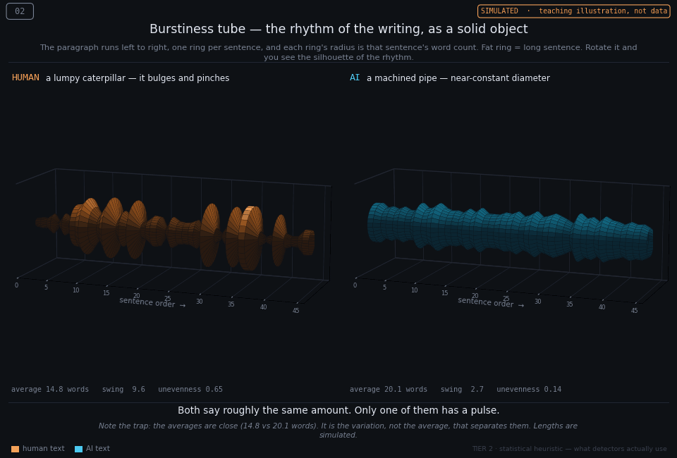
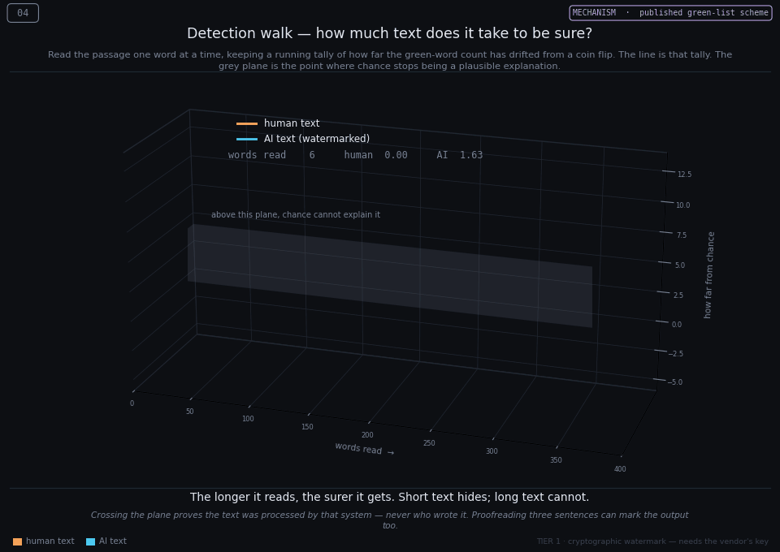
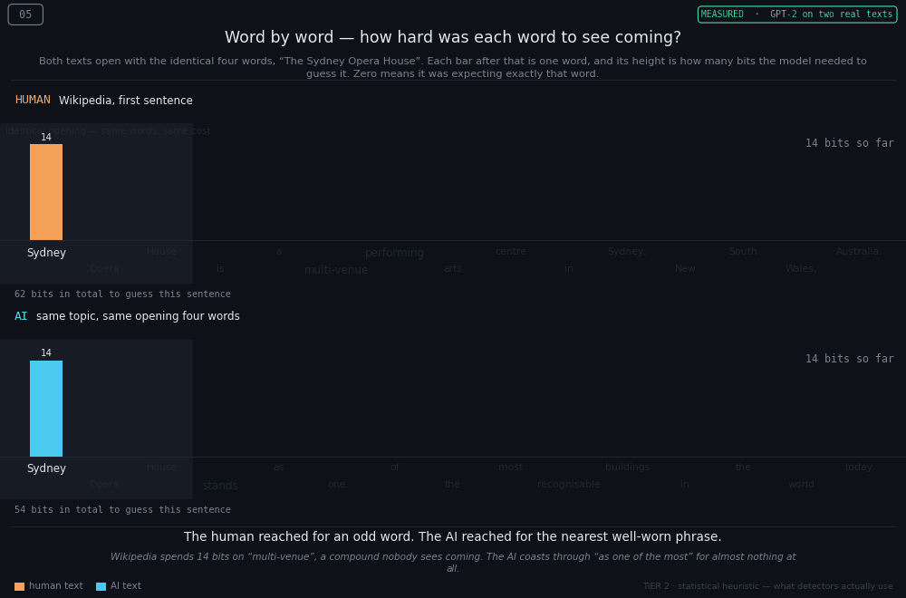
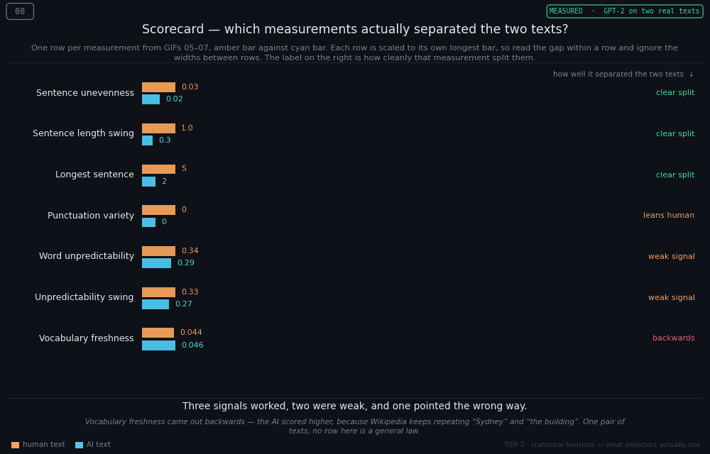
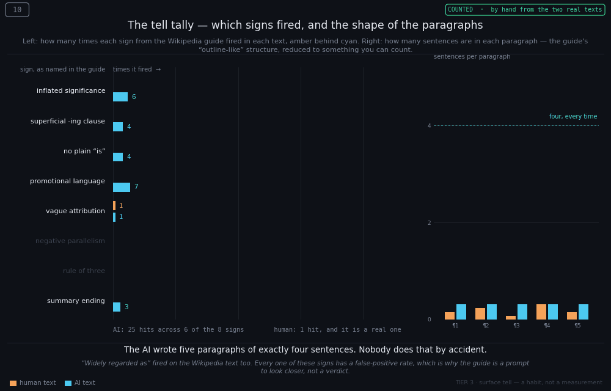

# AI Watermarks in Text — and How to Render Them in 3D

**Purpose of this file.** One place that consolidates (a) what an AI text watermark actually is, (b) the measurable signals that separate AI-generated prose from human prose, and (c) a tested visual language plus runnable code for turning those signals into rotating 3D GIFs — one showing what an AI paragraph "looks like," one showing what a human paragraph looks like.

**If you are presenting to a non-technical audience, start at [Part 8](#part-8--a-worked-example-for-a-non-technical-audience).** It takes one real Wikipedia article and one AI-written piece on the same topic, measures both with an actual language model, and turns the result into four GIFs built on real numbers. [Part 9](#part-9--the-tier-3-layer-wikipedias-signs-of-ai-writing) adds two more from Wikipedia's *Signs of AI writing*, which need no model at all. Parts 1–7 are the reference material behind them.

### The twelve GIFs at a glance

Every GIF states its own provenance on the frame — this table is the same information in one place.

| # | GIF | Data | Tier | The one line |
|---|---|---|---|---|
| 01 | Surprisal terrain | simulated | 2 | Human writing surprises the model; machine writing does not |
| 02 | Burstiness tube | simulated | 2 | Both say the same amount; only one has a pulse |
| 03 | Green-list lattice | mechanism | 1 | No single word is evidence — the tally is |
| 04 | Detection walk | mechanism | 1 | Short text hides; long text cannot |
| 05 | Word by word | measured | 2 | The human reached for an odd word; the AI for a worn phrase |
| 06 | Sentence skyline | counted | 2 | A real city versus a picket fence |
| 07 | Measured terrain | measured | 2 | Word choice alone will not tell you who wrote something |
| 08 | Scorecard | measured | 2 | Three signals worked, two were weak, one pointed backwards |
| 09 | Marked up | counted | 3 | 25 lit phrases against 1 — no model required |
| 10 | Tell tally | counted | 3 | Five paragraphs of exactly four sentences |
| 11 | Removal ladder | modelled | 1 | Layer A does nothing; two of four rewrites are still caught |
| 12 | Convergence | measured | 2 | No rewrite strength lands on human — they overshoot or fall short |

**Simulated** means invented from published typical ranges to teach the shape. **Measured** means GPT-2 on the two real texts. **Counted** means arithmetic anyone can redo by hand. **Mechanism** means the published green-list scheme, not the vendor's. **Modelled** means that scheme's arithmetic applied to a measured quantity — a projection, not an observation.

**Sources consolidated here:** `Convo.docx` (Q&A transcript on Claude watermarking, with press citations dated 11–14 Aug 2026) and `Watermrk.md` (Wayne Pan / Haimaker, "How to Remove Claude Watermarks From Content You Own", 12 Aug 2026).

**Reliability note, stated up front.** The vendor has published *that* it watermarks text; it has **not** published the algorithm or the detector. Everything in this document about *how* the watermark works is the canonical public scheme from the research literature, used here as a teaching model. Sections are tagged **[Confirmed]**, **[Inferred]**, or **[Illustrative]** so the distinction survives into any slide deck built from this.

---

## Part 1 — There are two separate marking channels

The single most common misconception in the source material is that "the watermark" is one thing. It is two, living in different places, with different removability. **[Confirmed]**

### Channel A — In-text statistical watermark

An imperceptible bias woven into the *choice and sequencing of tokens*. It is not a hidden character, not a file tag, and not visible to a reader. Because it *is* the prose, it travels wherever the prose travels: copy-paste, export to PDF, retype into a blank `.txt`, paste into an email. Applies to text and, by the same mechanism, to source code generated as text.

### Channel B — C2PA file provenance

Cryptographically signed provenance metadata attached to the *file container* for supported formats (`.png`, `.jpg`, `.svg` are cited). It marks the file, not the words. It is standard, inspectable metadata — and therefore trivially destroyed by any operation that rebuilds the container.

### The layer table

| Layer | Where it lives | Survives copy-paste? | Survives metadata strip? | Survives heavy paraphrase? |
|---|---|---|---|---|
| In-text statistical watermark | Token choices in the prose itself | **Yes** | **Yes** — unaffected | Degrades; not guaranteed gone |
| C2PA signed manifest | File container (PNG/JPEG/SVG segments) | No — text leaves the container | **No** — removed | N/A |
| EXIF / XMP / document properties | File container | No | **No** — removed | N/A |
| Invisible Unicode (ZWSP, bidi, tag chars) | Between the characters | Usually yes | Yes, by normalisation | Yes |
| Soft-bound / remote manifest | External service, referenced by link | N/A | Untouched | Untouched |

Two practical consequences from `Convo.docx`:

- **Scrubbing metadata does nothing to the text watermark.** `exiftool -all=` and screenshotting kill Channel B completely and Channel A not at all. Uploading an image to a social platform strips C2PA as a side effect of recompression.
- **Only editing the words touches Channel A.** Heavy paraphrasing, routing the text through a different model family, or keeping the sample very short are the listed levers — and none is certified, because the detector is private. **[Inferred]**

### What a detection actually proves

This matters more than the mechanics, and both sources agree on it:

- **A positive result means "processed by," not "written by."** Asking a model to proofread three sentences of your own draft can mark the output. The mark cannot distinguish that from full generation.
- **A negative result does not mean "human."** Older or unsupported models may not mark; ordinary editing reduces detectability; short extracts carry too little signal.

Both directions of that asymmetry should appear on any slide that shows a detector verdict.

---

## Part 2 — How the in-text watermark works

**[Inferred — this is the published Kirchenbauer et al. (2023) "green list" scheme, not a vendor disclosure.]** Use it as the mental model; do not present it as the vendor's implementation.

At each generation step:

1. **Seed.** Hash the previous token(s) with a secret key to seed a PRNG.
2. **Partition.** Use that seed to split the whole vocabulary into a **green list** (fraction γ, typically 0.5) and a **red list** (the rest). The split is *different at every position* and unrecoverable without the key.
3. **Bias.** Add a small constant δ to the logits of green tokens before sampling. Green words get gently preferred — never forced, so fluency and meaning survive.
4. **Repeat.** Next token, new hash, new green list.

**Detection** needs the key but not the model. Re-derive each position's green list, count how many of the text's actual tokens landed green, and compute:

$$z = \frac{|s|_G - \gamma n}{\sqrt{n\gamma(1-\gamma)}}$$

For γ = 0.5 this is `z = 2(|s|_G − n/2) / √n`. Unwatermarked text hits green ~50% of the time by chance, giving z ≈ 0. Watermarked text hits ~70%+, and z grows with **√n** — the longer the passage, the more certain the call.

| Tokens read | Green rate 50% (human) | Green rate 72% (watermarked) |
|---|---|---|
| 25 | z ≈ 0.0 | z ≈ 2.2 |
| 100 | z ≈ 0.0 | z ≈ 4.4 |
| 400 | z ≈ 0.0 | z ≈ 8.8 |
| 1000 | z ≈ 0.0 | z ≈ 13.9 |

Three properties fall out of this, and they are exactly what the 3D visuals need to convey:

- **No single word is evidence.** Any individual green token is a coin flip. The watermark exists only in the *aggregate tally*.
- **Length is the detector's ally.** This is why "keep it short" defeats detection and why a 2000-word essay cannot hide.
- **Editing is dilution, not deletion.** Replacing 30% of tokens with your own drops the green rate toward chance but rarely to it. In sufficiently long text a signal can persist through aggressive paraphrase.

---

## Part 3 — Signals that separate AI from human text

Three tiers, in descending order of evidential strength. Public "AI detectors" only have access to Tier 2 and Tier 3.

### Tier 1 — The cryptographic watermark

Decisive when present and when you hold the key. Near-zero false-positive rate by construction, because the z-score has a known null distribution. Unavailable to you, your university, or any third-party tool unless the vendor releases a detector.

### Tier 2 — Statistical heuristics (what detectors actually use)

**Perplexity** — how surprised a reference model is by each next token, measured in bits of surprisal. Human writing wanders: idiosyncratic word choice, unusual collocations, abrupt topic turns. Machine writing walks the high-probability path. **Low, flat surprisal is the single strongest heuristic signal.**

**Burstiness** — variance in sentence length and structure across a passage. Humans write a 34-word sentence, then a 4-word one. Then stop. Models converge on a comfortable 18–22 words and stay there. Measured as coefficient of variation, CV = sd/mean.

| Feature | Typical human | Typical AI | Direction |
|---|---|---|---|
| Mean surprisal | 4–7 bits | 1.5–3 bits | AI lower |
| Surprisal sd | 3–5 bits | 0.5–1.5 bits | AI far flatter |
| Sentence length mean | 12–20 words | 18–22 words | similar |
| Sentence length CV | 0.5–0.8 | 0.10–0.25 | **AI far more uniform** |
| Paragraph length CV | high | low | AI more uniform |
| Type–token ratio | higher | lower | AI more repetitive |
| Punctuation variety | high | low | AI narrower |

**[Illustrative]** — these ranges are order-of-magnitude teaching values, and they are the parameters the GIF generator samples from. They are not measurements from a labelled corpus. If this feeds academic work, measure your own corpus and substitute real numbers; the script is parameterised so that only the constants change.

**Honest accuracy caveat.** Tier 2 detectors have materially non-zero false-positive rates and are known to be biased against non-native English writers, whose prose is genuinely lower-perplexity. A short passage carries too little signal for any confident call. Tier 2 output is a prior, not a verdict — this belongs on the slide, not in a footnote.

### Tier 3 — Surface tells

Not statistical, just habits — useful to a human reader, easily edited away, and increasingly unreliable as models change:

- Em dash overuse; the "it's not X, it's Y" negative parallelism
- Rule of three everywhere ("clear, concise, and compelling")
- Inflated significance ("stands as a testament to", "plays a vital role in")
- Superficial `-ing` clause analyses tacked onto sentence ends
- Vague attribution ("experts say", "studies show") without a citation
- Section-final summary sentences that restate the section
- Suspiciously uniform paragraph lengths and heading rhythm
- Stray invisible Unicode — worth normalising regardless, since it breaks diffs and search

The definitive public catalogue of this tier is Wikipedia's [**Signs of AI writing**](https://en.wikipedia.org/wiki/Wikipedia:Signs_of_AI_writing), maintained by editors who read suspected AI drafts all day. It is far longer than the list above, organised by content, language, style, markup, citations and edit summaries, and it names each pattern with example phrases. [Part 9](#part-9--the-tier-3-layer-wikipedias-signs-of-ai-writing) turns the prose-level half of it into GIFs 09 and 10, measured on the same two real texts as Part 8.

---

## Part 4 — The 3D visual language

Prose is a 1-D sequence. Every visualisation below buys the third dimension by **splitting that sequence across two indices and putting a measurement on the vertical axis**. That is the whole trick, and it is worth stating on the first slide.

| # | Object | X | Y | Z | Colour |
|---|---|---|---|---|---|
| 1 | Surprisal terrain | token within sentence | sentence index | surprisal (bits) | height |
| 2 | Burstiness tube | sentence index | tube radius | tube radius | radius |
| 3 | Green-list lattice | word column | line | paragraph depth | green / red |
| 4 | Detection walk | tokens read | drift (decorative) | z-score | series |

Shared design rules: near-black `#0E1117` background; **human = amber `#F4A259`**, **AI = cyan `#4CC9F0`**, held constant across all four so the audience learns the colours once; 60 frames, ~70 ms, seamless loop; human panel always on the left; live metrics burned into the frame so the shape and the number are read together.

### The context frame

A GIF travels. It gets pulled into a slide, forwarded in a chat, screenshotted — and it arrives without this document. So every GIF in the set carries its own context, drawn by `gif_frame.py` in fixed pixel bands above and below the plot:

| Band | Carries | Why it is there |
|---|---|---|
| Top left | The GIF's number | So a viewer can ask about "07" and be understood |
| Top right | **Provenance badge** — `SIMULATED` / `MEASURED` / `COUNTED` / `MECHANISM` | The one piece of context the original set was missing. GIFs 01–04 are invented to teach the shapes; 05–10 are measurements. Out of context they looked identical, and a viewer would reasonably read all of them as data |
| Under the title | **How to read this** — the axes in plain English | Nobody should have to infer what the height means |
| Bottom, centre | **The takeaway**, one sentence | The line to say out loud |
| Bottom, italic | **The caveat** | What this particular picture does *not* prove — the honest half, in the frame rather than in a footnote |
| Bottom left / right | Colour legend, and the evidence tier | Amber/cyan is learned once; the tier says whether you are looking at a cryptographic proof, a statistic, or a habit |

Five GIFs — 05, 08, 10, 11 and 12 — are deliberately 2-D. When 3-D occludes the comparison or hides the words, the comparison wins.

---

### GIF 1 — Surprisal terrain


A paragraph becomes a landscape. Each row is a sentence, each column a token slot, and height is how surprised a reference model was by that token.

- **Human:** a jagged mountain range. Peaks at unexpected word choices, deep valleys at predictable function words. Rendered: mean 5.5 bits, sd 3.8.
- **AI:** a calm lake. A low, near-flat plane with gentle ripples. Rendered: mean 2.1 bits, sd 0.3.

**Takeaway line:** *Human writing surprises the model. Machine writing does not.*

This is the strongest of the four visually, because the contrast survives any viewing angle — which is exactly why it should open the sequence.

---

### GIF 2 — Burstiness tube



Extrude the paragraph along an axis and let the tube's radius be sentence length. Rotating it shows the silhouette of the writing's rhythm.

- **Human:** a lumpy caterpillar — bulges at long sentences, sharp pinches at short ones. Rendered: mean 14.8 words, CV 0.65.
- **AI:** a machined pipe of near-constant diameter. Rendered: mean 20.1 words, CV 0.14.

**Takeaway line:** *Both say roughly the same amount. Only one has a pulse.*

Note the deliberate trap here: the **means are similar** (14.8 vs 20.1) while the **variances are not**. It makes the point that averages hide the tell and dispersion reveals it.

---

### GIF 3 — Green-list lattice


726 tokens as a rotating cube of dots, each coloured by whether it landed on that position's secret green list. This is the mechanism visualisation — the only one that shows the actual watermark rather than a heuristic.

- **Human:** a 50/50 confetti of green and red. z = 0.7. Indistinguishable from coin flips, because that is what it is.
- **AI:** visibly green-dominant. z = 12.3. Red survives — the bias is soft — but the ratio is unmistakable.

**Takeaway line:** *No single word is evidence. The tally is overwhelming.*

Equal marker sizes for green and red are load-bearing: an earlier draft drew green larger, which made *both* panels look green and destroyed the comparison. Green/red is also the one colourblind-hostile choice in the set — state the percentages aloud, or swap red for `#B39DDB` violet for a CVD-safe audience.

---

### GIF 4 — Detection walk



The only animated-over-time panel: both texts are read token by token and their running z-scores are traced against a translucent z = 4 threshold plane.

- **Human:** hovers around zero, wandering but bounded, never crossing.
- **AI:** climbs past the plane within ~100 tokens and stays above it, ending at z = 7.50 after 400 tokens (human ends at 0.50).

**Takeaway line:** *The longer it reads, the more certain it gets. Short text hides; long text cannot.*

This closes the sequence because it answers the question the first three provoke — *how much text do you need?* — and it visually motivates the "keep it short" evasion from `Convo.docx`.

---

### Not built — the embedding cloud

The one idea in this visual language that was never built. Sentence embeddings reduced by PCA to three axes: human sentences scatter into a diffuse cloud, AI sentences collapse into a tight ellipsoid — semantic monotony as spatial density. It needs a real embedding model, so it is the natural extension once you move to real text (Part 6). Numbered slots 01–10 are taken; it would be 11.

---

## Part 5 — Building the GIFs

Dependencies are `numpy`, `matplotlib`, and `Pillow` only. No ffmpeg, no imageio.

```bash
python3 make_3d_watermark_gifs.py          # 01-04, writes ./gifs/*.gif
python3 make_real_text_gifs.py             # 05-08, needs example/profiles.json
python3 make_surface_tell_gifs.py          # 09-10, needs example/*.txt

OUTDIR=slides/anim python3 make_3d_watermark_gifs.py    # write elsewhere
FRAMES=3 python3 make_real_text_gifs.py                 # fast layout preview
```

All three scripts import `gif_frame.py`, which owns the palette, the context frame described above, the panel grid, and `write_gif`. Nothing about the data lives there, so changing the wording on every GIF at once means editing one file.

One note on `write_gif`: every frame is quantised against a **single shared palette**, built from four sampled frames plus a painted strip of the brand colours. Choosing a palette per frame — the obvious implementation, and the original one — let amber and cyan drift between frames on the text-heavy panels, and turned an 11-pixel legend swatch grey.

Runs in ~11 s for all four. Output is 960×459–480 px, 60 frames, 2.3–5.1 MB each.

**Knobs worth turning:**

| Want | Change |
|---|---|
| Smaller files | `colors=140` → `64`; or `FRAMES = 60` → `40` |
| Sharper for print/projector | `DPI = 100` → `200` (files grow ~4×) |
| Slower rotation | `duration=70` → `110` |
| Different data | the `rng.lognormal` / `rng.normal` parameters at the top of each function |
| Your brand colours | `HUMAN` / `AI` / `GREEN` / `RED` constants |

**Reproducibility:** `SEED = 7` fixes every random draw, so reruns are byte-identical and the numbers quoted in Part 4 stay true.

<details>
<summary><strong>Full source of <code>make_3d_watermark_gifs.py</code></strong> (click to expand — this file is self-contained)</summary>

```python
#!/usr/bin/env python3
"""Render four 3-D comparisons of AI-generated vs human-written prose as GIFs."""

import os
import numpy as np
import matplotlib
matplotlib.use("Agg")
import matplotlib.pyplot as plt
from matplotlib.colors import LinearSegmentedColormap
from PIL import Image

OUT = os.environ.get("OUTDIR", "gifs")
os.makedirs(OUT, exist_ok=True)

BG      = "#0E1117"
FG      = "#E6E9EF"
MUTED   = "#7A8394"
HUMAN   = "#F4A259"
AI      = "#4CC9F0"
GREEN   = "#3DDC97"
RED     = "#EF476F"
FRAMES  = 60
DPI     = 100
SEED    = 7

plt.rcParams.update({
    "figure.facecolor": BG, "savefig.facecolor": BG,
    "text.color": FG, "axes.labelcolor": MUTED,
    "xtick.color": MUTED, "ytick.color": MUTED,
    "font.size": 8,
})

cmap_h = LinearSegmentedColormap.from_list("h", ["#2A1B10", "#8A4B1A", HUMAN, "#FFE3B0"])
cmap_a = LinearSegmentedColormap.from_list("a", ["#0B2733", "#12657F", AI, "#CFF3FF"])


def style3d(ax, zlabel="", xlabel="", ylabel=""):
    ax.set_facecolor(BG)
    for pane in (ax.xaxis, ax.yaxis, ax.zaxis):
        pane.pane.set_facecolor(BG)
        pane.pane.set_edgecolor("#232833")
        pane.pane.set_alpha(1.0)
        pane._axinfo["grid"]["color"] = "#232833"
        pane._axinfo["grid"]["linewidth"] = 0.5
    ax.set_xlabel(xlabel, labelpad=-6)
    ax.set_ylabel(ylabel, labelpad=-6)
    ax.set_zlabel(zlabel, labelpad=-6)
    ax.tick_params(labelsize=6, pad=-2)


def write_gif(fig, path, update, frames=FRAMES, duration=70):
    imgs = []
    for i in range(frames):
        update(i)
        fig.canvas.draw()
        buf = np.asarray(fig.canvas.buffer_rgba())[..., :3]
        im = Image.fromarray(buf).convert("P", palette=Image.ADAPTIVE, colors=140)
        imgs.append(im)
    imgs[0].save(path, save_all=True, append_images=imgs[1:], loop=0,
                 duration=duration, optimize=True, disposal=2)
    plt.close(fig)
    print(f"  {path}  {os.path.getsize(path)/1e6:.2f} MB")


def smooth(a, k=1):
    """Tiny box blur so surfaces read as terrain rather than noise."""
    out = a.astype(float).copy()
    for _ in range(k):
        p = np.pad(out, 1, mode="edge")
        out = (p[:-2, 1:-1] + p[2:, 1:-1] + p[1:-1, :-2] + p[1:-1, 2:] + 4 * out) / 8
    return out


# ---------------------------------------------------------------- 1. terrain
def gif_surprisal_terrain():
    rng = np.random.default_rng(SEED)
    ns, nt = 16, 26                      # sentences x token slots

    human = rng.lognormal(1.45, 0.72, (ns, nt))
    spikes = rng.random((ns, nt)) < 0.10
    human[spikes] += rng.uniform(5, 11, spikes.sum())
    human = np.clip(human, 0.2, 16)

    ai = rng.normal(2.1, 0.55, (ns, nt))
    ai += 0.35 * np.sin(np.linspace(0, 6, nt))[None, :]
    ai = smooth(np.clip(ai, 0.2, 16), 2)

    X, Y = np.meshgrid(np.arange(nt), np.arange(ns))
    fig = plt.figure(figsize=(9.6, 4.6), dpi=DPI)
    axes = []
    for k, (Z, cm, title, mean) in enumerate([
        (human, cmap_h, "HUMAN  ·  high, spiky surprisal", human.mean()),
        (ai, cmap_a, "AI  ·  low, flat surprisal", ai.mean()),
    ]):
        ax = fig.add_subplot(1, 2, k + 1, projection="3d")
        ax.plot_surface(X, Y, Z, cmap=cm, vmin=0, vmax=14, rstride=1, cstride=1,
                        linewidth=0.2, edgecolor=BG, antialiased=True, shade=True)
        ax.set_zlim(0, 15)
        style3d(ax, "surprisal (bits)", "token", "sentence")
        ax.text2D(0.03, 0.90, title, transform=ax.transAxes, color=FG, fontsize=9.5)
        ax.text2D(0.03, 0.03, f"mean {mean:4.1f} bits   sd {Z.std():4.1f}",
                  transform=ax.transAxes, color=MUTED, fontsize=7)
        axes.append(ax)

    fig.suptitle("Surprisal terrain — how surprised a language model is by each next token",
                 color=FG, fontsize=11, y=0.985)
    fig.subplots_adjust(left=0.0, right=1.0, top=0.99, bottom=-0.02, wspace=0.0)

    def update(i):
        for ax in axes:
            ax.view_init(elev=26 + 6 * np.sin(2 * np.pi * i / FRAMES), azim=-60 + 360 * i / FRAMES)

    write_gif(fig, f"{OUT}/01_surprisal_terrain.gif", update)


# ---------------------------------------------------------------- 2. rhythm
def gif_burstiness_tube():
    rng = np.random.default_rng(SEED + 1)
    n = 46
    hl = np.clip(rng.lognormal(2.6, 0.60, n), 3, 52)     # human sentence lengths
    al = np.clip(rng.normal(19.5, 2.6, n), 3, 52)        # AI sentence lengths

    th = np.linspace(0, 2 * np.pi, 60)
    x = np.arange(n)

    fig = plt.figure(figsize=(9.6, 4.6), dpi=DPI)
    axes = []
    for k, (L, cm, col, title) in enumerate([
        (hl, cmap_h, HUMAN, "HUMAN  ·  erratic rhythm"),
        (al, cmap_a, AI, "AI  ·  metronomic rhythm"),
    ]):
        ax = fig.add_subplot(1, 2, k + 1, projection="3d")
        R = L[:, None] / 2
        T, XX = np.meshgrid(th, x)
        RR = np.repeat(R, len(th), axis=1)
        ax.plot_surface(XX, RR * np.cos(T), RR * np.sin(T), cmap=cm,
                        vmin=2, vmax=26, rstride=1, cstride=2,
                        linewidth=0.15, edgecolor=BG, antialiased=True)
        ax.set_xlim(0, n); ax.set_ylim(-26, 26); ax.set_zlim(-26, 26)
        ax.set_box_aspect((3.1, 1, 1))
        ax.set_yticks([]); ax.set_zticks([])
        style3d(ax, "", "sentence order", "")
        ax.text2D(0.05, 0.88, title, transform=ax.transAxes, color=FG, fontsize=9.5)
        cv = L.std() / L.mean()
        ax.text2D(0.05, 0.04, f"mean {L.mean():4.1f} words   sd {L.std():4.1f}   CV {cv:.2f}",
                  transform=ax.transAxes, color=MUTED, fontsize=7)
        axes.append(ax)

    fig.suptitle("Burstiness tube — radius is sentence length, extruded along the paragraph",
                 color=FG, fontsize=11, y=0.985)
    fig.subplots_adjust(left=0.0, right=1.0, top=1.0, bottom=0.01, wspace=0.0)

    def update(i):
        for ax in axes:
            ax.view_init(elev=12 + 6 * np.sin(2 * np.pi * i / FRAMES), azim=360 * i / FRAMES)

    write_gif(fig, f"{OUT}/02_burstiness_tube.gif", update)


# ---------------------------------------------------------------- 3. lattice
def gif_token_lattice():
    rng = np.random.default_rng(SEED + 2)
    a, b, c = 11, 11, 6
    n = a * b * c
    gx, gy, gz = np.meshgrid(np.arange(a), np.arange(b), np.arange(c), indexing="ij")
    gx, gy, gz = gx.ravel(), gy.ravel(), gz.ravel()

    hg = rng.random(n) < 0.50      # unwatermarked: chance-level green list hits
    ag = rng.random(n) < 0.72      # watermarked: biased toward the green list

    def z(g):
        return 2 * (g.sum() - 0.5 * n) / np.sqrt(n)

    fig = plt.figure(figsize=(9.6, 4.8), dpi=DPI)
    axes = []
    for k, (g, title) in enumerate([(hg, "HUMAN  ·  green hits at chance"),
                                    (ag, "AI  ·  green hits far above chance")]):
        ax = fig.add_subplot(1, 2, k + 1, projection="3d")
        ax.scatter(gx[g], gy[g], gz[g], c=GREEN, s=20, depthshade=True,
                   edgecolors="none", alpha=0.92)
        ax.scatter(gx[~g], gy[~g], gz[~g], c=RED, s=20, depthshade=True,
                   edgecolors="none", alpha=0.92)
        style3d(ax, "", "", "")
        ax.set_xticks([]); ax.set_yticks([]); ax.set_zticks([])
        ax.text2D(0.03, 0.91, title, transform=ax.transAxes, color=FG, fontsize=9.5)
        ax.text2D(0.03, 0.05, f"green {100*g.mean():4.1f}%   z = {z(g):5.1f}",
                  transform=ax.transAxes, color=GREEN if z(g) > 4 else MUTED, fontsize=8)
        axes.append(ax)

    fig.suptitle("Green-list lattice — every token is a vote; the watermark is the tally, not any one word",
                 color=FG, fontsize=11, y=0.985)
    fig.subplots_adjust(left=0.0, right=1.0, top=0.99, bottom=0.0, wspace=0.0)

    def update(i):
        for ax in axes:
            ax.view_init(elev=18 + 8 * np.sin(2 * np.pi * i / FRAMES), azim=360 * i / FRAMES)

    write_gif(fig, f"{OUT}/03_green_list_lattice.gif", update)


# ---------------------------------------------------------------- 4. z-walk
def gif_detection_walk():
    rng = np.random.default_rng(SEED + 3)
    n = 400
    hb = (rng.random(n) < 0.50).astype(float)
    ab = (rng.random(n) < 0.72).astype(float)
    idx = np.arange(1, n + 1)

    def zwalk(bits):
        return 2 * (np.cumsum(bits) - 0.5 * idx) / np.sqrt(idx)

    hz, az = zwalk(hb), zwalk(ab)
    hy = np.cumsum(rng.normal(0, 0.10, n))
    ay = np.cumsum(rng.normal(0, 0.10, n))

    fig = plt.figure(figsize=(9.6, 5.0), dpi=DPI)
    ax = fig.add_subplot(111, projection="3d")
    ax.set_box_aspect((2.3, 0.75, 1.15), zoom=1.30)
    style3d(ax, "detection z-score", "tokens read", "drift")
    ax.set_xlim(0, n); ax.set_ylim(-3, 3); ax.set_zlim(-6, 14)

    P, Q = np.meshgrid(np.linspace(0, n, 2), np.linspace(-3, 3, 2))
    ax.plot_surface(P, Q, np.full_like(P, 4.0), color="#9AA3B2", alpha=0.13,
                    linewidth=0, shade=False)
    ax.text(n * 0.05, 3, 4.6, "z = 4  detection threshold", color=MUTED, fontsize=7)

    lh, = ax.plot([], [], [], color=HUMAN, lw=2.0, label="human")
    la, = ax.plot([], [], [], color=AI, lw=2.0, label="AI (watermarked)")
    ph = ax.scatter([], [], [], color=HUMAN, s=22)
    pa = ax.scatter([], [], [], color=AI, s=22)
    ax.legend(loc="upper left", bbox_to_anchor=(0.12, 0.90), frameon=False,
              fontsize=8.5, labelcolor=FG)
    txt = fig.text(0.10, 0.045, "", color=MUTED, fontsize=8.5, family="monospace")

    fig.subplots_adjust(left=0.0, right=1.0, top=1.0, bottom=0.0)
    fig.text(0.5, 0.955, "Detection walk — the watermark score climbs with every token read",
             color=FG, fontsize=11, ha="center")

    def update(i):
        m = max(2, int(n * (i + 1) / FRAMES))
        lh.set_data(idx[:m], hy[:m]); lh.set_3d_properties(hz[:m])
        la.set_data(idx[:m], ay[:m]); la.set_3d_properties(az[:m])
        ph._offsets3d = ([idx[m - 1]], [hy[m - 1]], [hz[m - 1]])
        pa._offsets3d = ([idx[m - 1]], [ay[m - 1]], [az[m - 1]])
        txt.set_text(f"tokens read {m:4d}     human z = {hz[m-1]:5.2f}     AI z = {az[m-1]:5.2f}")
        ax.view_init(elev=20, azim=-72 + 26 * np.sin(2 * np.pi * i / FRAMES))

    write_gif(fig, f"{OUT}/04_detection_walk.gif", update, duration=85)


if __name__ == "__main__":
    print("rendering:")
    gif_surprisal_terrain()
    gif_burstiness_tube()
    gif_token_lattice()
    gif_detection_walk()
    print("done ->", os.path.abspath(OUT))
```

</details>

---

## Part 6 — Driving the visuals with real text

The GIFs above are **simulated** from the Part 3 parameters. That is right for teaching the shapes, and wrong for anything empirical. To make them measurements:

**Sentence lengths (GIF 2)** — no model needed, stdlib only:

```python
import re, statistics
def rhythm(text):
    sents = [s for s in re.split(r'(?<=[.!?])\s+', text.strip()) if s]
    lens = [len(s.split()) for s in sents]
    m, sd = statistics.mean(lens), statistics.pstdev(lens)
    return {"lengths": lens, "mean": m, "sd": sd, "cv": sd / m}
```

Feed `rhythm(text)["lengths"]` straight into `hl` / `al` in `gif_burstiness_tube`.

**Surprisal (GIF 1)** — needs a local model with logprob access; a small GPT-2 via `transformers` is enough, and using a *different* model than the one under test avoids circularity:

```python
# per-token surprisal in bits: -log2 P(token | context)
# reshape the resulting 1-D array to (n_sentences, n_token_slots) and pass as `human` / `ai`
```

**Green-list membership (GIF 3)** — cannot be computed for real vendor output. It requires the secret key. Keep this panel labelled **[Illustrative]**; it explains the mechanism, and no public tool can reproduce it against real Claude text.

**A defensible study design**, if this is heading toward coursework: collect N human and N AI paragraphs matched on topic and length, compute surprisal and CV for each, report distributions with confidence intervals, and show the overlap honestly. The overlap is the finding — a clean separation would be the suspicious result.

---

## Part 7 — What these visuals do and do not claim

Put a version of this on the final slide:

**They do show:** the mechanism by which a token-level bias becomes a statistically detectable signal; why aggregate evidence beats any single word; why passage length governs detection confidence; the genuine distributional differences in surprisal and rhythm that heuristic detectors exploit.

**They do not show:** the vendor's actual algorithm (unpublished); measurements from real text (Part 4 numbers are simulated — GIFs 05–10 are the measured ones, and the provenance badge on each frame says which you are looking at); that any given paragraph is AI-written — Tier 2/3 signals overlap between classes and are biased against non-native writers; that a mark's presence proves authorship, or its absence proves human origin.

**The framing sentence, if you only get one:** *A watermark answers "did this system touch this text?" — never "who wrote it?"*

---

## Sources

From the supplied files:

- Anthropic / Claude Help Center — *How Claude marks AI-generated content* — `support.claude.com/en/articles/16266773`
- C2PA specification — `c2pa.org`; manifest types — `opensource.contentauthenticity.org/docs/manifest/understanding-manifest/`
- Wayne Pan, *How to Remove Claude Watermarks From Content You Own* (`Watermrk.md`, 12 Aug 2026)
- `Convo.docx` transcript, citing Forbes, CNET, PhoneArena, Medium, Reddit and Instagram coverage, 11–14 Aug 2026
- Guillaume Meyer, `watermarks-remover` — `github.com/guillaumemeyer/watermarks-remover`
- *WaterPark* evaluation, Findings of EMNLP 2025 — `aclanthology.org/2025.findings-emnlp.1148/` — 10 watermarking methods against 12 attacks
- ICLR 2024 — robustness of watermarks under human paraphrase — `proceedings.iclr.cc/paper_files/paper/2024/hash/d78e9e4316e1714fbb0f20be66f8044c-Abstract-Conference.html`
- Sean Goedecke, *Text AI watermarks will always be trivial to remove*, 2 Jul 2026

Underlying Part 9 (added here, not from the source files):

- Wikipedia, *Wikipedia:Signs of AI writing* — `en.wikipedia.org/wiki/Wikipedia:Signs_of_AI_writing` — the editor-maintained catalogue of Tier 3 surface tells, implemented in `surface_tells.py`

Underlying Part 10 (already cited above, read properly this time):

- Guillaume Meyer, `watermarks-remover` — `github.com/guillaumemeyer/watermarks-remover` — MIT. `service/scripts/text_unicode.py` is vendored verbatim under `vendor/`; the Layer B prompts in `service/scripts/rewrite_text.py` are quoted in Part 10

Underlying the Part 2 mechanism (not cited in the source files, added here because Part 2 depends on it):

- Kirchenbauer, Geiping, Wen, Katz, Miers, Goldstein, *A Watermark for Large Language Models*, ICML 2023 — the green-list/red-list scheme and z-score detector reproduced above

---

*Files:*

| File | What it is |
|---|---|
| `AI-Watermarks-3D.md` | This document |
| `gif_frame.py` | Palette, context frame, panel grid, `write_gif` — shared by all three renderers |
| `make_3d_watermark_gifs.py` | GIFs 01–04, simulated |
| `measure_texts.py` | GPT-2 per-word surprisal → `example/profiles.json` |
| `make_real_text_gifs.py` | GIFs 05–08, measured |
| `surface_tells.py` | Wikipedia's Tier 3 catalogue as regexes; runnable on its own |
| `make_surface_tell_gifs.py` | GIFs 09–10, counted |
| `vendor/watermarks_remover/` | `text_unicode.py` from guillaumemeyer/watermarks-remover, verbatim, MIT |
| `analyse_removal.py` | Runs the remover over the AI text and measures every variant |
| `make_removal_gifs.py` | GIFs 11–12, from `example/removal/analysis.json` |
| `example/removal/` | The Layer A output, four Layer B rewrites, both intermediates, and the analysis |
| `example/` | The two source texts and the measured profile |
| `gifs/01–10*.gif` | The output |

---

## Part 8 — A worked example, for a non-technical audience

Everything above Part 7 uses **simulated** data to teach the shapes. This part uses **real text and real measurements**, and it is the version to present to people who do not want to hear the word "perplexity."

### The setup: same topic, two authors

| | Human | AI |
|---|---|---|
| Source | Wikipedia, *Sydney Opera House* (opening section) | Written by an AI, prompted for an encyclopedia-style overview of the same subject |
| Length | 345 words, 12 sentences | 333 words, 20 sentences |
| File | `example/human_wikipedia.txt` | `example/ai_generated.txt` |

Matching the topic and the length matters. If the two texts were about different things, or one were twice as long, every difference below could be explained away by that instead. Here the only real variable is who wrote it.

### How "hard to guess" is measured

We show a real language model (GPT-2) the text one word at a time and ask it, at every step, to predict what comes next before revealing the answer. If it guessed easily, the word scores near **0**. If the word blindsided it, the word scores high — **14** is roughly "one chance in sixteen thousand."

The plain-English version for a slide: **we make a machine play a guessing game with the text, and we plot how often it loses.**

Everything below is that one number, arranged in space.

---

### GIF 5 — Word by word



Both texts open with the *identical* four words: "The Sydney Opera House." Then they part company, and the whole argument is visible in one sentence each. The GIF reveals the words left to right, one at a time, with a running bit total — the same order the model saw them in.

| Wikipedia | | AI | |
|---|---|---|---|
| is | 3 | stands | **11** |
| a | 3 | as | 2 |
| **multi-venue** | **14** | one | 3 |
| performing | 8 | of | 0 |
| arts | 0 | the | 0 |
| centre | 2 | most | 1 |
| | | recognisable | 5 |
| **total: 62 bits** | | **total: 54 bits** | |

The human sentence spends 14 bits on **"multi-venue"** — a compound nobody sees coming — and 8 more on "performing." The AI spends 11 on "stands" and then coasts: **"as one of the most"** costs 2 + 3 + 0 + 0 + 1, almost nothing at all. It is a phrase the model has seen a million times.

**Say this out loud:** *The human reached for an odd word. The AI reached for the nearest well-worn phrase. That is the difference, and you can see it without knowing any statistics.*

---

### GIF 6 — The sentence skyline


This is the clearest result of the whole exercise, and it needs no model at all — only counting words per sentence.

```
Wikipedia   16  27  43  22  26  39  20  24  34  19  59  17
AI          16  22  16  14  17  20  10  19  24  16  17  15  15  15  20  11  20  10  22  15
```

Wikipedia lurches: 43, then 22. Then 39. One sentence runs **59 words**. The AI writes twenty sentences and never once leaves the **10–24** band.

| | Wikipedia | AI |
|---|---|---|
| Average sentence | 28.8 words | 16.7 words |
| Swing (std. dev.) | **12.3** | **3.8** |
| Unevenness (CV) | **0.42** | **0.23** |
| Longest sentence | 59 | 24 |

**Say this out loud:** *A human skyline looks like a real city — towers and low-rises jumbled together. The AI builds a picket fence.*

If you show only one GIF, show this one. It is the biggest real difference, it needs no language model to reproduce, and anyone can verify it by counting.

---

### GIF 7 — The measured terrain


The same landscape as GIF 1 in Part 4 — but built from the real measurements instead of simulated ones. **Compare the two side by side and you learn something uncomfortable:** the real terrains look far more alike than the textbook picture promised.

| | Simulated (Part 4) | Measured (here) |
|---|---|---|
| Human average | 5.5 bits | **4.15 bits** |
| AI average | 2.1 bits | **3.61 bits** |
| Gap | 3.4 bits — a cliff | **0.54 bits — a slope** |

The human text is still less predictable, and its peaks still go higher. But the gap is a fraction of what the teaching illustration implies. Two honest caveats belong on this slide:

- Wikipedia is unusually dense with proper nouns, dates and place names. Its highest-scoring words are exactly that: "Bennelong" (18), "Estate" (17), "1957" (15), "Farm" (16). Ordinary human writing would not match that, so this comparison flatters the human side.
- The AI wrote about a world-famous landmark, which is the easiest possible case for it.

**Say this out loud:** *Word choice alone will not tell you who wrote something. Anyone selling you a detector that claims otherwise is overselling.*

---

### GIF 8 — The scorecard



Every measurement, ranked by how well it actually separated the two texts.

| Measurement | Wikipedia | AI | Verdict |
|---|---|---|---|
| Sentence unevenness (CV) | 0.42 | 0.23 | **clear split** |
| Sentence length swing | 12.3 | 3.8 | **clear split** |
| Longest sentence | 59 | 24 | **clear split** |
| Punctuation variety | 5 kinds | 2 kinds | leans human |
| Word unpredictability | 4.15 | 3.61 | weak signal |
| Unpredictability swing | 4.07 | 3.29 | weak signal |
| Vocabulary freshness (TTR) | 0.548 | 0.574 | **no signal — and backwards** |

That last row is the one to dwell on. The textbook says AI text repeats itself more, so it should score *lower*. It scored **higher**. Wikipedia keeps saying "Sydney," "the building," "the Opera House," and that repetition drags the human score down. **The rule of thumb was simply wrong for this pair.**

This is a single pair of texts, so no row here is a general law — the point of the scorecard is the *shape* of the result, not the exact numbers.

**Say this out loud:** *Three signals worked, two were weak, and one pointed the wrong way. That is why "an AI detector said so" is not evidence.*

---

### The six-slide version

1. **Two texts, same topic.** Show both. Ask the room to guess which is which. Most will guess right — and that intuition is what we are about to measure.
2. **GIF 5 — word by word.** "multi-venue" versus "as one of the most."
3. **GIF 6 — the skyline.** The picket fence. This is the moment the room gets it.
4. **GIF 8 — the scorecard.** What worked, what didn't, what pointed backwards.
5. **GIF 10 — the tell tally.** Five paragraphs of exactly four sentences — and the one row where Wikipedia trips the same rule.
6. **The honest ending.** Everything measured here is *style*, not proof. The real watermark (Parts 1–2) is a cryptographic signal only the vendor can read — and it answers "did our system touch this?", never "who wrote this?"

### Reproducing it

```bash
python3 -m venv venv && ./venv/bin/pip install torch transformers numpy matplotlib pillow
./venv/bin/python measure_texts.py      # GPT-2 surprisal -> example/profiles.json
python3 make_real_text_gifs.py          # profiles.json   -> gifs/05..08
python3 make_surface_tell_gifs.py       # example/*.txt   -> gifs/09..10
```

`measure_texts.py` downloads `gpt2-large` (~3 GB) on first run and takes a few seconds on CPU. To swap in your own texts, replace `example/human_wikipedia.txt` and `example/ai_generated.txt` — nothing else changes. Everything downstream needs only numpy/matplotlib/Pillow, so once `profiles.json` exists the GIFs rebuild on any machine; GIFs 09–10 skip the model entirely and read the text files directly.

**Two deliberate design departures:** GIF 8 is 2D, because a 3D scorecard was built first and the bars occluded each other so badly that the numbers were unreadable. GIF 5 is 2D for the same reason — in 3D the word labels overlapped, and reading the actual words is the entire point of that panel. When 3D actively hides the comparison, the comparison wins.

### What this example can and cannot support

**Supports:** that a human and an AI writing on the same topic leave genuinely different measurable fingerprints; that rhythm separates them far better than vocabulary; that the differences are visible without any statistics training.

**Does not support:** any claim about a specific document — this is n = 1 per class. Nothing here detects the cryptographic watermark from Parts 1–2, which needs the vendor's key. And the Wikipedia text is encyclopedic register, not ordinary human prose, so a casual email or a student essay would score differently. For coursework, run the pipeline over 30+ matched pairs and report the distributions and their overlap.

---

## Part 9 — The Tier 3 layer: Wikipedia's *Signs of AI writing*

Part 8 measured the two texts. This part **reads** them, against the catalogue that Wikipedia's editors maintain at [Wikipedia:Signs of AI writing](https://en.wikipedia.org/wiki/Wikipedia:Signs_of_AI_writing) — the most complete public list of the surface habits in Tier 3.

Why it belongs in the set: it is the only tier a non-technical audience can verify unaided. No model, no key, no statistics — you read the sentence and you either see the habit or you don't. It is also the weakest evidentially, and putting it last makes that ordering explicit.

### What the scanner checks

`surface_tells.py` implements eight of the guide's prose-level categories as conservative regexes, each traceable back to a named pattern on that page. The structural, markup, citation and edit-summary sections of the guide are not covered — they are about wikitext, not prose, and none of them applies to a plain `.txt`.

| Category (the guide's name) | What it means in one line |
|---|---|
| Undue emphasis on significance | Puffing a fact up into a milestone or a symbol |
| Superficial `-ing` analysis | A clause bolted onto the end that restates rather than adds |
| Avoidance of basic copulatives | Reaching for "serves as" where "is" would do |
| Promotional language | Brochure adjectives standing in for facts |
| Vague attribution | "Widely regarded", "experts say" — by whom? |
| Negative parallelism | "Not just X, but Y" and its relatives |
| Rule of three | Three-item lists used as a default rhythm |
| Section-final summary | A closing sentence that only restates the paragraph |

Run it on its own to see the tally and every phrase it matched:

```bash
python3 surface_tells.py
```

### GIF 09 — Reading with the guide in hand


Both texts in full, side by side, in monospace. A reading cursor descends the page and each matched phrase lights up as the cursor reaches it, with a caption naming which sign it is and what that sign means.

**Result: 25 lit phrases in the AI text, 1 in the Wikipedia text.**

The AI paragraph is dense with them: *stands as*, *serves as a leading*, *powerful symbol*, *remarkable*, *is home to*, *which contribute to*, *rich and varied*, *plays a vital role*, *outstanding*, *remains a testament*, *every corner of the globe*, *represents a lasting*. Three of its five paragraphs end on a summary sentence — *As a result…*, *Today…*, *It remains…*

**Say this out loud:** *You do not need a model for this one. You need the list, and five minutes.*

### GIF 10 — The tell tally



Left: how many times each sign fired in each text. Right: sentences per paragraph — the guide's "outline-like" structure, reduced to something anyone can count.

| Sign | Wikipedia | AI |
|---|---|---|
| Inflated significance | 0 | **6** |
| Promotional language | 0 | **7** |
| Avoidance of copulatives | 0 | **4** |
| Superficial `-ing` clause | 0 | **4** |
| Summary endings | 0 | **3** |
| Vague attribution | **1** | **1** |
| Negative parallelism | 0 | 0 |
| Rule of three | 0 | 0 |
| **Sentences per paragraph** | **2, 3, 1, 4, 2** | **4, 4, 4, 4, 4** |

Two rows carry the argument, in opposite directions.

**The paragraph shape.** The AI wrote five paragraphs of exactly four sentences each. Wikipedia's run 2, 3, 1, 4, 2 — including a one-sentence paragraph, which no model produces unprompted. This is the same finding as GIF 06 one level up: the metronome shows in the paragraphs as clearly as in the sentences.

**The false positive.** *"Widely regarded as one of the world's most famous and distinctive buildings"* — that is the Wikipedia text, and it fires the vague-attribution rule, correctly. The habit is a genuine habit; it is simply also a thing human encyclopedists do. Every row in this table has a false-positive rate, and a list of habits is a prompt to look closer, never a verdict.

**Say this out loud:** *Nobody writes five paragraphs of exactly four sentences by accident. And "widely regarded" is not proof of anything, because Wikipedia said it first.*

### Where this tier sits

Tier 3 is the easiest to check and the easiest to defeat — every one of these twenty-five phrases can be edited away in an afternoon, which is exactly what the humanising tools do. Its value is not detection. It is that it gives a reader something concrete to point at, and it teaches the shape of the thing before any statistics arrive.

**The ordering to keep:** Tier 1 is proof you cannot run. Tier 2 is a statistic with a real error rate. Tier 3 is a habit. Present them in that order and the audience ends up with calibrated scepticism rather than a detector they trust too much.

---

## Part 10 — Running a watermark remover at the text, and measuring what came off

Parts 8 and 9 measured the AI text. This part attacks it, with the tool already cited in the sources: [`guillaumemeyer/watermarks-remover`](https://github.com/guillaumemeyer/watermarks-remover) (MIT). The question is the obvious one — **how much of the modelling actually changes** — and the answer splits cleanly in two, because the tool does.

### What the tool actually is

| | Layer A | Layer B |
|---|---|---|
| File | `service/scripts/text_unicode.py` | `service/scripts/rewrite_text.py` |
| Method | Deterministic character surgery | An LLM rewrite |
| Targets | Zero-width chars, bidi controls, tag chars (U+E0001–E007F), variation selectors, private-use planes, 16 space homoglyphs, optional Cyrillic/fullwidth confusables | Word choice, clause order, connectors, sentence boundaries |
| Ships a model? | No — it is pure `str` processing | **No.** The default backend is `print-prompt`: it emits a prompt and you supply the rewriter |
| Attacks | Channel B-ish carriers — invisible Unicode | Channel A — the in-text statistical watermark |

That second row of "no" is the thing to understand before reading any number below. Layer A is the whole of what the repository *executes* on text. Layer B is a prompt, five of them, selected by `--strength`:

- `paraphrase` — *"substantially different wording at the token level… Change clause order, connectors, and transition words; vary sentence boundaries and length; and replace both content words and function words where meaning allows. Preserve all facts, numbers, names."*
- `humanize` — *"…so it reads as if a human wrote it from scratch. Vary sentence rhythm and length, replace formulaic AI-style transitions and filler with concrete natural phrasing."*
- `backtranslate` — *"Translate the text to {lang}, then translate that result back to {original_lang}. Preserve all facts, numbers, and names."* The default pivot is French.
- `structural` — *"First extract a bullet outline of all claims (no full sentences). Then write a complete document from that outline in natural, varied human prose without omitting any bullet."*
- `code` — the same idea for comments, docstrings and identifier names. Not applicable to prose, so not run here.

All four prose strengths were run. Both two-step strengths keep their intermediate artefact in `example/removal/`, so the round trip is auditable: `ai_backtranslate_fr_pivot.txt` is the French, `ai_structural_outline.txt` is the outline.

The repo also carries its own effectiveness metric, `_lexical_divergence` — bigram Jaccard distance between original and rewrite — used to pick the most-diverged candidate when you generate several. Part 10 reports that same number so the comparison is on the tool's own terms.

### Method, and its two honest limits

`vendor/watermarks_remover/text_unicode.py` is the upstream file, unmodified, so Layer A here **is** the tool. `analyse_removal.py` runs it, then measures five variants — the human article, the untouched AI text, the Layer A output, and the two Layer B rewrites — against every metric in Parts 8 and 9.

Two limits, both load-bearing:

1. **The Layer B rewrites are mine, not the tool's.** The repo emits a prompt; I ran the verbatim `paraphrase` and `humanize` prompts and wrote the outputs. So these are *a* result of the tool's method, not *the* result — a different rewriter moves every number. Worse, a rewriter that knows which metrics are about to be computed is a real confound, and I knew. Treat the direction of each effect as the finding and the magnitude as one sample.
2. **The z-scores are modelled, never measured.** We do not hold the vendor's key, so no detection score in this project is an observation. What `modelled_z` does is measure **bigram survival** — the fraction of the original text's word pairs still present — and feed it through the published scheme's arithmetic. The reasoning: a token only carries green-list evidence while the token *before* it is unchanged, because that preceding token is what seeds the position's green list. Surviving pairs keep the watermarked green rate, destroyed ones fall back to chance:

   $$p = 0.72s + 0.5(1-s), \qquad z = \frac{(p - 0.5)\sqrt{n}}{\sqrt{0.25}}$$

   This is why GIF 11 wears a `MODELLED` badge rather than `MEASURED`.

### The results

```bash
python3 -c "import sys; sys.path.insert(0,'vendor/watermarks_remover'); \
            from text_unicode import clean_text; \
            print(clean_text(open('example/ai_generated.txt').read())[1])"
python3 analyse_removal.py            # add --no-surprisal to skip the GPT-2 columns
python3 make_removal_gifs.py          # -> gifs/11, gifs/12
```

Ordered by how much watermark evidence each one leaves behind:

| | words | sents | CV | TTR | tells | paragraphs | divergence | bigrams left | modelled z | facts kept | bits |
|---|---|---|---|---|---|---|---|---|---|---|---|
| *human article* | 346 | 12 | 0.42 | 0.535 | 1 | 2,3,1,4,2 | — | — | *1.53* | — | 4.15 |
| AI, untouched | 334 | 20 | 0.23 | 0.574 | 25 | 4,4,4,4,4 | 0.000 | 100% | **8.07** | 100% | 3.61 |
| Layer A | 334 | 20 | 0.23 | 0.574 | 25 | 4,4,4,4,4 | 0.000 | 100% | **8.07** | 100% | 3.61 |
| Layer B `backtranslate` | 329 | 20 | 0.22 | 0.586 | 15 | 4,4,4,4,4 | 0.422 | 73% | **5.83** | 100% | 3.93 |
| Layer B `paraphrase` | 335 | 20 | 0.27 | 0.593 | 15 | 4,4,4,4,4 | 0.617 | 56% | **4.50** | 97% | 4.38 |
| Layer B `structural` | 284 | 17 | 0.53 | 0.645 | 8 | 3,4,4,3,3 | 0.691 | 45% | *3.37* | 100% | 4.98 |
| Layer B `humanize` | 288 | 19 | 0.73 | 0.632 | 6 | 3,5,3,4,4 | 0.785 | 34% | *2.56* | 97% | 5.18 |

### GIF 11 — The removal ladder


**Layer A changed nothing. Not "almost nothing" — nothing.** Input and output were byte-identical: 0 characters removed, 0 replaced, on a 2,087-character text. The tool's own inspector agrees, and says why:

> `No deterministic Layer A (invisible Unicode/format) carriers detected; statistical and pixel-domain marks are out of scope here.`

The only non-ASCII character in either text is the `ø` in *Jørn Utzon*, which is a Norwegian letter, not a carrier. This is the layer-table from Part 1 confirmed by experiment: **scrubbing characters does not touch a watermark that lives in word choice.** Anyone who runs the deterministic half of a remover and concludes they are clean has tested nothing.

**Two of the four rewrite strengths are still caught.** The spread between them is the real result — they are not interchangeable:

| Strength | Bigrams left | Modelled z | Verdict |
|---|---|---|---|
| `backtranslate` | 73% | 5.83 | **still caught, comfortably** |
| `paraphrase` | 56% | 4.50 | **still caught** |
| `structural` | 45% | 3.37 | under the line |
| `humanize` | 34% | 2.56 | under the line |

**`backtranslate` is the weakest attack in the set, and it is the one people reach for first.** Round-tripping through French left **73%** of the original word pairs intact — more than any other strength — because translation works sentence by sentence and hands back something with the same skeleton. z = 5.83, nowhere near evading. It also left the rhythm signature completely untouched: sentence unevenness went from 0.23 to **0.22**, and the paragraph metronome stayed at a perfect 4,4,4,4,4. A round trip changes the words a translator would change and nothing else.

**`paraphrase` halves the evidence and is still caught** at z = 4.50. This is Part 2's "editing is dilution, not deletion" with a number attached: a rewrite that changes 62% of the bigrams still leaves enough aggregate signal to call, because z falls linearly in survival while the evidence is spread across every token.

**`structural` is the best trade in the set.** Outline the claims, then write the document from the outline: 45% survival, z = 3.37 (under the line), **100% of facts kept**, and — uniquely — it lands *closest to the human article* on sentence unevenness (0.53 against Wikipedia's 0.42). Writing from an outline forces the structure to be re-chosen rather than edited, which is exactly the thing paraphrase and backtranslation cannot do.

**`humanize` goes furthest**, to 34% survival and z = 2.56, but overshoots the style target hardest (CV 0.73) and is the only strength to drop a fact.

**Say this out loud:** *The half of the tool that runs by itself does nothing. Of the half that works, the gentlest option — translate it and translate it back — is barely an attack at all, and the only one that really breaks the mark is the one that makes you write the document again from notes.*

### GIF 12 — Convergence, and the overshoot


The second question — does it stop *looking* like AI — has a stranger answer.

| Measurement | AI | backtrans. | paraphrase | structural | humanize | human | closest lands |
|---|---|---|---|---|---|---|---|
| Sentence unevenness | 0.23 | 0.22 | 0.27 | **0.53** | 0.73 | 0.42 | `structural`, +0.11 past |
| Wikipedia tells | 25 | 15 | 15 | 8 | **6** | 1 | `humanize`, +5 short |
| Word unpredictability | 3.61 | **3.93** | 4.38 | 4.98 | 5.18 | 4.15 | `backtranslate`, −0.22 short |
| Vocabulary freshness | 0.574 | **0.586** | 0.593 | 0.632 | 0.645 | 0.535 | `backtranslate`, +0.051 — further than the AI text |

**No strength lands on human.** Two measures overshoot, one never gets there, and one moves further away with every strength applied. The `humanize` output is *more* uneven in sentence length than a real encyclopedia article, and its words are *harder* for GPT-2 to guess: 5.18 bits against Wikipedia's 4.15. On the Tier 2 heuristics that public detectors actually run, that text now reads as more human than the human.

Note which column keeps winning the "closest" contest: **`backtranslate`, the strength that removes the least.** It sits nearest the human values on two of four measures purely because it barely moved anything — the AI text was already close on those axes. Proximity to human is not evidence of laundering, and laundering is not evidence of proximity. The two questions are independent, which is why GIFs 11 and 12 have to be read together.

That is not a success story. It is the failure mode of the whole tier, made concrete: **these metrics have no upper bound at "human."** A detector thresholding on perplexity or burstiness cannot tell "authentic" from "overcooked", and the same overshoot that evades it would flag a florid human writer. Vocabulary freshness repeats the backwards result from GIF 08 for a third time — every variant moves *away* from the human value, because the human text keeps repeating "Sydney" and "the building".

**The one honest signal is the Wikipedia tells**, and only because it has a floor at zero and a named list behind it. 25 → 15 → 8 → 6 is real progress, and the best of them is still six times the human article's one. `paraphrase` and `backtranslate` both stall at 15 and both leave the paragraph metronome at a perfect 4,4,4,4,4 — neither prompt asks for structural change, so neither delivers it. What survives everything is the promotional vocabulary: *rich and varied*, *ambitious*, *innovative*, *outstanding*, *every corner of the globe* are in all four rewrites.

**One caveat on that column, against my own scanner.** Part of `backtranslate`'s 25 → 15 is an artefact. The round trip turned *"widely regarded"* into *"generally considered"* and *"As a result,"* into *"therefore"* — the habit is completely intact, the string no longer matches my regex. A surface-tell scanner counts phrasings, not habits, and translation is very good at changing phrasings while changing nothing else. Read that column as a lower bound on what a human editor would flag.

### What it cost

`backtranslate` and `structural` kept **100%** of the proper nouns and numbers; `paraphrase` and `humanize` kept 97%. The misses are instructive: `humanize` dropped **1959** — the construction start date — by compressing it to "two years after that", and shed 46 words. `structural` shed 50 words and lost nothing, because working from an explicit outline of the claims is a checklist, and a checklist is harder to drop an item from than a paragraph is. The repo says this itself, in the README: rewording *"replaces the original word choices with the rewriting model's,"* which *"flattens tone, voice, and precision."* On a Wikipedia-style factual paragraph, precision is most of the value.

### The verdict on efficiency

| Question | Answer |
|---|---|
| Does the tool remove the statistical watermark? | Not by itself. Its executable half is a no-op on this text; its effective half is a prompt with no model attached. |
| Does backtranslation evade detection? | **No, and it is the worst of the four** — z = 5.83 at 73% survival. It leaves the rhythm signature exactly as it found it. |
| Does a paraphrase-strength rewrite evade detection? | **No** — z = 4.50, still above threshold, at 56% survival. |
| Do `structural` or `humanize` evade detection? | **Yes** on this text — z = 3.37 and 2.56 — but at 45% and 34% survival, which is close to writing it again. |
| Which strength is the best trade? | `structural`: under the threshold, 100% of facts kept, and the closest of any variant to the human article's sentence rhythm. |
| Does the text stop looking like AI? | No strength lands on human. Two Tier 2 measures overshoot, vocabulary freshness moves away, and the Tier 3 count stays six times the human baseline. |
| What does it cost? | 97–100% of facts kept, one date lost at `humanize`, 14% of the length, and the original voice. |

**The framing sentence for this part:** *A remover cannot remove what it cannot see, and the part of the mark that matters is not in the characters — it is in the words, which means removing it and rewriting it are the same operation.*

Which is also why the Part 7 caveat survives intact: none of this tells you who wrote anything. It tells you how much of a text has to be replaced before a specific statistical signal falls below a specific threshold — and at 34% survival, the honest description of what happened is not "the watermark was removed" but "a different text was written."
