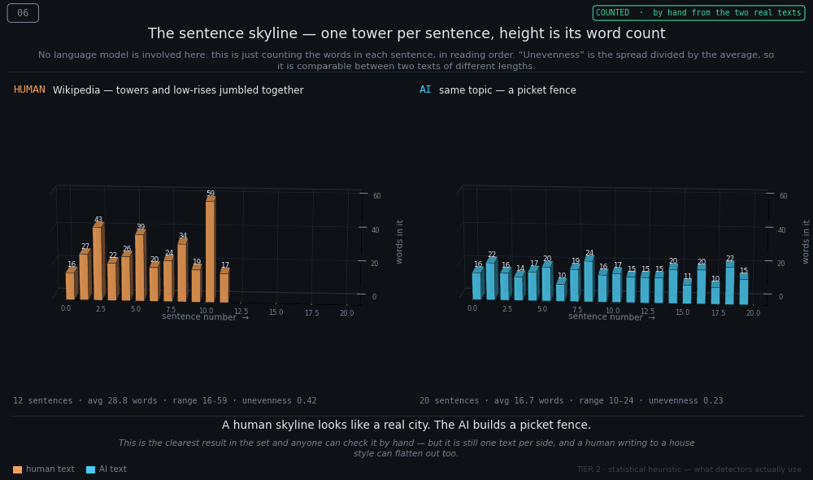
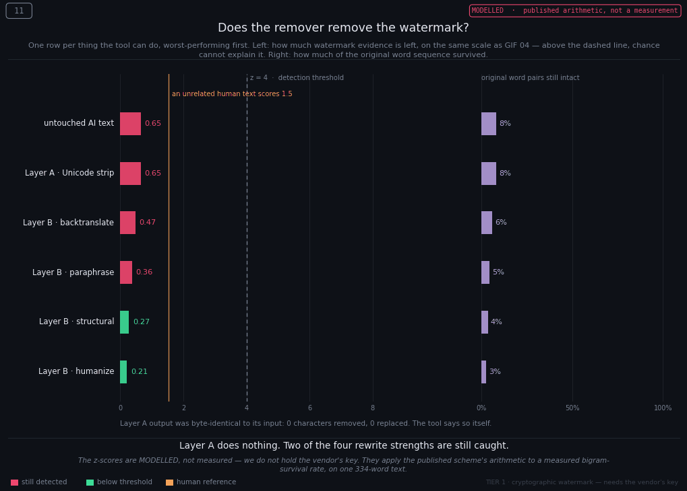
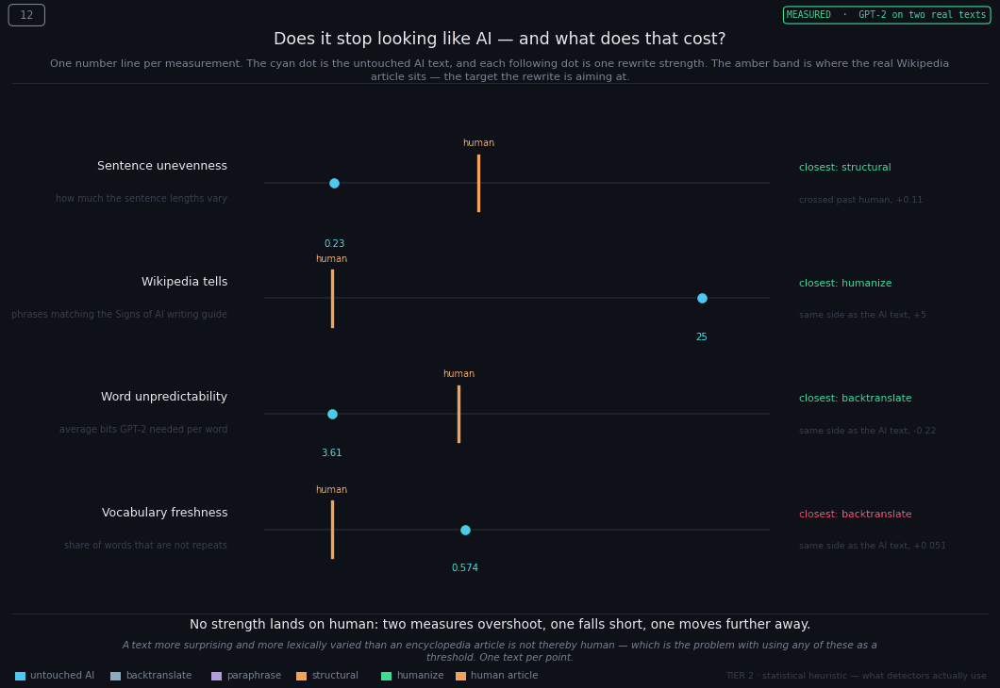

# AI Watermarks in Text, and How to Render Them in 3D

What an AI text watermark actually is, which signals really separate machine prose
from human prose, and twelve rotating GIFs that make the difference visible without
requiring any statistics.

Every number here comes from **one matched pair of texts**, the opening of the
Wikipedia article on the Sydney Opera House, and an AI-written encyclopedia-style
piece on the same subject, at the same length. Same topic, same length, one variable.



> Wikipedia lurches: 43 words, then 22, then 39, then one sentence of 59.
> The AI writes twenty sentences and never leaves the 10–24 band.
> **A human skyline looks like a real city. The AI builds a picket fence.**

**📄 The full write-up is [`AI-Watermarks-3D.md`](AI-Watermarks-3D.md)**, ten parts,
covering the mechanism, the visual language, the worked example, and two experiments.

---

## The three things this repository found

### 1. The textbook picture oversells the word-level signal

Teaching illustrations show human writing as a jagged mountain range and AI writing
as a calm lake, a gap of 3.4 bits. Measured on real text with GPT-2, the gap is
**0.54 bits.** Real terrains look far more alike than the diagram promises. Word
choice alone will not tell you who wrote something.

### 2. Rhythm separates them. Vocabulary points the wrong way.

| Measurement | Wikipedia | AI | Verdict |
|---|---|---|---|
| Sentence unevenness (CV) | 0.42 | 0.23 | **clear split** |
| Longest sentence | 59 | 24 | **clear split** |
| Sentences per paragraph | 2, 3, 1, 4, 2 | **4, 4, 4, 4, 4** | **clear split** |
| Word unpredictability | 4.15 bits | 3.61 bits | weak |
| Vocabulary freshness (TTR) | 0.548 | 0.574 | **backwards** |

The AI wrote five paragraphs of *exactly four sentences*. Nobody does that by
accident. Meanwhile vocabulary freshness came out backwards, the AI scored
*higher*, because Wikipedia keeps repeating "Sydney" and "the building".

### 3. A watermark remover mostly cannot remove the watermark

I ran [guillaumemeyer/watermarks-remover](https://github.com/guillaumemeyer/watermarks-remover)
at the AI text and measured every variant.



**Layer A, the deterministic Unicode strip, the only part the tool actually
executes, changed nothing.** Byte-identical output: 0 characters removed, 0
replaced. It cannot touch a watermark that lives in word choice.

Layer B is a *prompt*; the repo ships no model. Of its four prose strengths, two
still get caught:

| Strength | Original word pairs left | Modelled detection score | |
|---|---|---|---|
| `backtranslate` (EN→FR→EN) | 73% | 5.83 | **still caught** |
| `paraphrase` | 56% | 4.50 | **still caught** |
| `structural` | 45% | 3.37 | under the line |
| `humanize` | 34% | 2.56 | under the line |

Backtranslation, the attack people reach for first, is the *weakest* in the set.
It leaves the rhythm signature exactly as it found it: sentence unevenness went
0.23 → **0.22**, paragraphs stayed at 4,4,4,4,4.

### And the uncomfortable one



No rewrite strength lands *on* human. Two measures overshoot past it, one never
gets there, one moves further away. The `humanize` output is **more** uneven in
sentence length than a real encyclopedia article, and its words are **harder** for
GPT-2 to guess, 5.18 bits against Wikipedia's 4.15.

On the heuristics public AI detectors actually run, that laundered text now reads
as more human than the human. Which is the whole problem with using any of them as
a threshold.

---

## The twelve GIFs

Every GIF carries its own context, how to read the axes, where the numbers came
from, the takeaway, and the caveat, so it still makes sense pulled into a slide.
The badge in the top right says which kind of number you are looking at.

| # | GIF | Data | Tier | The one line |
|---|---|---|---|---|
| 01 | [Surprisal terrain](gifs/01_surprisal_terrain.gif) | simulated | 2 | Human writing surprises the model; machine writing does not |
| 02 | [Burstiness tube](gifs/02_burstiness_tube.gif) | simulated | 2 | Both say the same amount; only one has a pulse |
| 03 | [Green-list lattice](gifs/03_green_list_lattice.gif) | mechanism | 1 | No single word is evidence, the tally is |
| 04 | [Detection walk](gifs/04_detection_walk.gif) | mechanism | 1 | Short text hides; long text cannot |
| 05 | [Word by word](gifs/05_word_by_word.gif) | measured | 2 | The human reached for an odd word; the AI for a worn phrase |
| 06 | [Sentence skyline](gifs/06_sentence_skyline.gif) | counted | 2 | A real city versus a picket fence |
| 07 | [Measured terrain](gifs/07_measured_terrain.gif) | measured | 2 | Word choice alone will not tell you who wrote something |
| 08 | [Scorecard](gifs/08_scorecard.gif) | measured | 2 | Three signals worked, two were weak, one pointed backwards |
| 09 | [Marked up](gifs/09_marked_up.gif) | counted | 3 | 25 lit phrases against 1, no model required |
| 10 | [Tell tally](gifs/10_tell_tally.gif) | counted | 3 | Five paragraphs of exactly four sentences |
| 11 | [Removal ladder](gifs/11_removal_ladder.gif) | modelled | 1 | Layer A does nothing; two of four rewrites are still caught |
| 12 | [Convergence](gifs/12_convergence.gif) | measured | 2 | No rewrite strength lands on human |

**Simulated** = invented from published typical ranges, to teach the shape.
**Measured** = GPT-2 on the real texts. **Counted** = arithmetic you can redo by
hand. **Mechanism** = the published green-list scheme, not any vendor's.
**Modelled** = that scheme's arithmetic applied to a measured quantity.

**Tier 1** is the cryptographic watermark (needs the vendor's key, nobody has it).
**Tier 2** is statistical heuristics (what detectors actually use). **Tier 3** is
surface tells (habits, from
[Wikipedia:Signs of AI writing](https://en.wikipedia.org/wiki/Wikipedia:Signs_of_AI_writing)).

---

## Reproducing it

```bash
git clone https://github.com/nisaharan/ai-watermarks-3d
cd ai-watermarks-3d
pip install -r requirements.txt

# GIFs 01-04 (simulated) and 09-12 (no model needed)
python3 make_3d_watermark_gifs.py
python3 make_surface_tell_gifs.py
python3 make_removal_gifs.py
python3 surface_tells.py            # print the Tier 3 tally for both texts

# GIFs 05-08 need GPT-2 for per-word surprisal (~3 GB on first run)
pip install torch transformers
python3 measure_texts.py            # -> example/profiles.json
python3 make_real_text_gifs.py
python3 analyse_removal.py          # the Part 10 table; --no-surprisal to skip torch
```

Swap in your own texts by replacing `example/human_wikipedia.txt` and
`example/ai_generated.txt`, nothing else changes.

`FRAMES=3 python3 make_*.py` renders a fast preview while you are adjusting layout.
`OUTDIR=somewhere python3 make_*.py` writes elsewhere.

## Layout

| Path | What it is |
|---|---|
| `AI-Watermarks-3D.md` | The full write-up, Parts 1–10 |
| `gif_frame.py` | Palette, context frame, panel grid, GIF writer, shared by all renderers |
| `make_3d_watermark_gifs.py` | GIFs 01–04 |
| `measure_texts.py` | GPT-2 per-word surprisal → `example/profiles.json` |
| `make_real_text_gifs.py` | GIFs 05–08 |
| `surface_tells.py` | Wikipedia's Tier 3 catalogue as regexes; runnable standalone |
| `make_surface_tell_gifs.py` | GIFs 09–10 |
| `analyse_removal.py` | Runs the remover over the AI text, measures every variant |
| `make_removal_gifs.py` | GIFs 11–12 |
| `vendor/watermarks_remover/` | Layer A of watermarks-remover, verbatim, MIT |
| `example/` | The two source texts, the measured profile, and the rewrites |

---

## What this does and does not claim

**It shows** how a token-level bias becomes a statistically detectable signal; why
aggregate evidence beats any single word; why passage length governs detection
confidence; and that rhythm separates human from machine far better than vocabulary.

**It does not show** any vendor's actual algorithm, none is published. It does not
show that a given paragraph is AI-written: this is n=1 per class, the signals overlap
between classes, and they are known to be biased against non-native English writers.
The Wikipedia extract is encyclopedic register, not ordinary prose, so a casual email
would score differently.

Two limits worth stating plainly, both spelled out in Part 10:

1. **The Layer B rewrites are mine, not the tool's.** The repo emits a prompt and you
   supply the rewriter. A rewriter that knows which metrics are about to be computed
   is a real confound. Treat the *direction* of each effect as the finding and the
   magnitude as one sample.
2. **No detection score here is a measurement.** Nobody outside the vendor holds the
   key. `modelled_z` measures bigram survival and runs it through the published
   scheme's arithmetic. GIF 11 wears a `MODELLED` badge for exactly this reason.

**If you take one sentence:** *a watermark answers "did this system touch this text?"
— never "who wrote it?"*

---

## Licence

MIT for the code and GIFs ([`LICENSE`](LICENSE)); CC BY-SA 4.0 for the prose and
example texts ([`LICENSE-DOCS`](LICENSE-DOCS)), because the analysis is derived from
Wikipedia material that carries share-alike.

Third-party attributions, the vendored MIT file, the Wikipedia extracts, and the
sources cited but deliberately not redistributed, are in [`NOTICE.md`](NOTICE.md).
